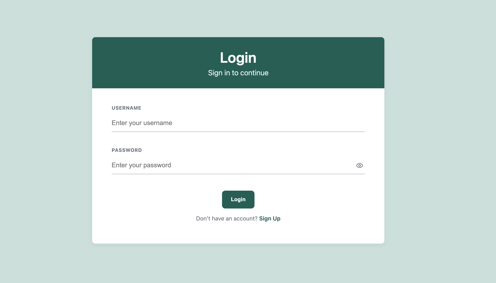
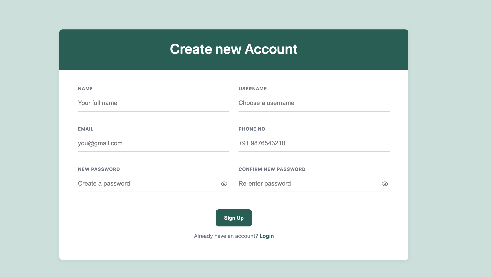

# React Login & SignUp App

A modern, responsive React application with login and signup functionality, featuring professional animations, form validation, and clean UI design.

## Screenshots

### Login Page


### SignUp Page


## Features

- ✅ **Responsive Design** - Works seamlessly on desktop, tablet, and mobile
- ✅ **Form Validation** - Real-time validation with clear error messages
- ✅ **Smooth Animations** - Professional page transitions and interactive elements
- ✅ **Modern UI** - Clean design with SCSS styling
- ✅ **Password Visibility Toggle** - Using professional Lucide icons
- ✅ **Routing** - React Router for navigation between pages
- ✅ **TypeScript** - Type-safe development

## Validation Rules

- **Name**: Only alphabets and spaces allowed
- **Username**: Alphanumeric with special characters (._-@#$!%*)
- **Password**: Same character set as username, must differ from username
- **Confirm Password**: Must match the password field
- **Email**: Must be a valid Gmail address (@gmail.com)
- **Phone**: Country code format (+<country> <number>)

## Tech Stack

- **React 18** with TypeScript
- **React Router DOM** for navigation
- **SCSS** for styling
- **Lucide React** for icons
- **Create React App** for build tooling

## Getting Started

### Prerequisites

- Node.js (version 14 or higher)
- npm or yarn

### Installation

1. Clone the repository:
```bash
git clone https://github.com/sumeetbidhan/signup-app.git
cd signup-app
```

2. Install dependencies:
```bash
npm install
```

3. Start the development server:
```bash
npm start
```

4. Open [http://localhost:3000](http://localhost:3000) to view it in the browser.

## Available Scripts

### `npm start`
Runs the app in development mode with hot reload.

### `npm test`
Launches the test runner in interactive watch mode.

### `npm run build`
Builds the app for production to the `build` folder.

### `npm run eject`
**Note: This is a one-way operation!** Ejects from Create React App for full configuration control.

## Project Structure

```
src/
├── components/
│   ├── FormInput.tsx      # Reusable form input component
│   └── HeaderBar.tsx      # Page header component
├── pages/
│   ├── Login.tsx          # Login page
│   └── SignUp.tsx         # SignUp page
├── styles/
│   ├── global.scss        # Global styles and animations
│   └── form.scss          # Form-specific styles
├── utils/
│   └── validation.ts      # Form validation functions
└── App.tsx                # Main app with routing
```

## Animations & UX Features

- **Page Transitions**: Smooth fade-in and slide-up animations
- **Form Fields**: Staggered appearance with slide-in effects
- **Button Interactions**: Hover effects with elevation and shimmer
- **Password Toggle**: Animated eye icons with scale effects
- **Input Focus**: Subtle lift and color transitions
- **Error Messages**: Smooth slide-down animations

## Browser Support

- Chrome (latest)
- Firefox (latest)
- Safari (latest)
- Edge (latest)

## Contributing

1. Fork the repository
2. Create your feature branch (`git checkout -b feature/AmazingFeature`)
3. Commit your changes (`git commit -m 'Add some AmazingFeature'`)
4. Push to the branch (`git push origin feature/AmazingFeature`)
5. Open a Pull Request

## License

This project is licensed under the MIT License - see the [LICENSE](LICENSE) file for details.

## Author

**Sumeet Bidhan**
- GitHub: [@sumeetbidhan](https://github.com/sumeetbidhan)